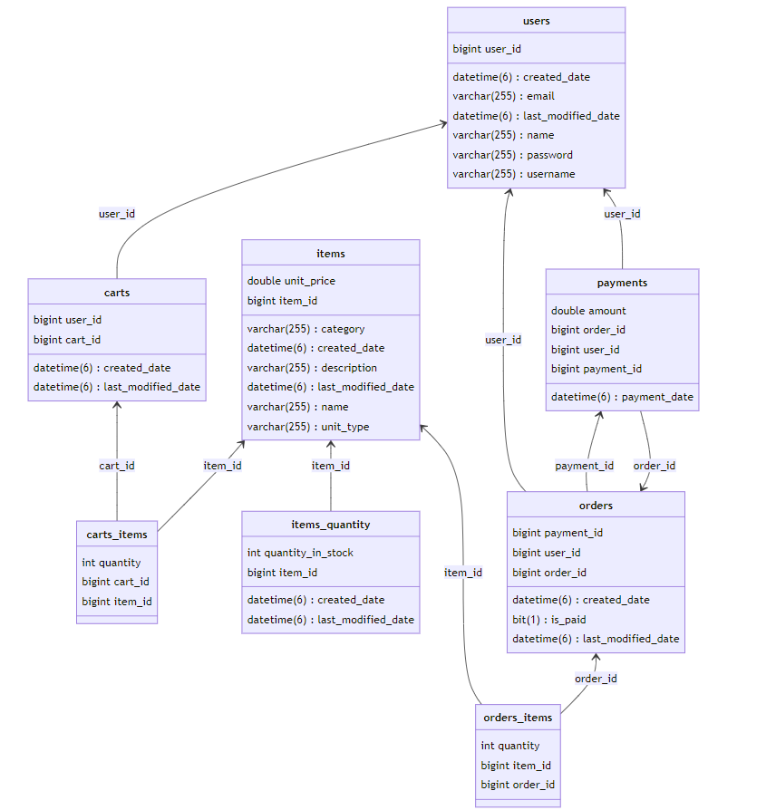

# Food Market Project

This project is a web application designed to facilitate online food ordering. It consists of a
backend developed in Java Spring, frontend developed in Angular and MySQL database for persistence layer.
 
Additionally, there are Docker images for individual services to enable deployment in various environments.

## List of Contents

1. [Setup Instructions](#setup-instructions)
2. [Backend](#backend-java-spring)
3. [Frontend](#frontend-angular)
4. [Containers](#docker-compose-configuration)
4. [GUI](#gui)

## Setup Instructions:

1. Ensure you have Docker and Docker Compose installed on your system.
2. Clone the repository.
3. Navigate to the root directory of the project.
4. Run `docker-compose up` to start the services.
5. Application will be available at http://localhost:8081

## Backend Java Spring

The backend of the Food Market project is built using Java Spring framework, offering robustness and scalability. It
provides various endpoints to handle user authentication, products management, order processing, and other
functionalities
required for an online food ordering system.

### Technologies Used:

- Java 17
- Java Spring Boot
- Spring Security
- Spring Data JPA
- MySQL
- RESTful API

### Security:

In the project there is implemented basic authentication for user access control:

- **Basic Authentication**: Users are required to provide their username and password when making requests to the
  backend API.
- **Cookie Creation**: Upon successful authentication, the backend generates a cookie containing a token. This cookie is
  sent back to the client and stored in the browser. Subsequent API calls include this
  cookie, allowing the backend to authenticate the user for each request.

This basic authentication mechanism helps secure the backend API endpoints and ensures that only authenticated users can
access protected resources.

### Relational Model:

This relational model represents the structure of tables in a database.

## Frontend Angular

The frontend of the Food Market project is built using Angular framework, providing a modern and responsive user
interface for customers to browse through products available, place orders, and manage their accounts.

### Technologies Used:

- Angular
- TypeScript
- HTML
- Bootstrap styling

## Docker Compose Configuration

Docker Compose configuration is provided to easily deploy the Food Market project along with its dependencies in
isolated containers.

### Services Included:

- Backend (Java Spring)
- Frontend (Angular)
- MySQL Database

## GUI

### List of GUI components:

- **Login Form**
  

  
  

    - The login form allows user to enter their credentials.

- **Registration Form**

  

  
  

    - The registration form allows new users to create an account.

- **Home Page**

  

  
  

    - The home page serves as the main landing page of the application.

- **Items Page**

  

  
  

    - The items page displays a list of available items for user to browse and add to cart.

- **Item Creation Form**

  

  
  

    - The item creation form allows users to add new items to inventory.

- **Cart Page**

  

  
  

    - The cart page display the items added by the user to the cart allowing them to review, modify and proceed to
      checkout.

- **Payment Details**

  

  
  

    - The payment details page shows ordered items and total price.

- **Orders Page**

  

  
  

    - The orders page displays a history of orders placed by the user, providing details such as payment status and
      date.

- **Payments Page**

  

  
  

    - The payments page displays a history of payments made by the user.

- **User Profile Page**

  

  
  

    - The user profile page allows user to see their credentials.

- **New Password Form**

  

  
  

    - The new password form allows user to modify their credentials.
